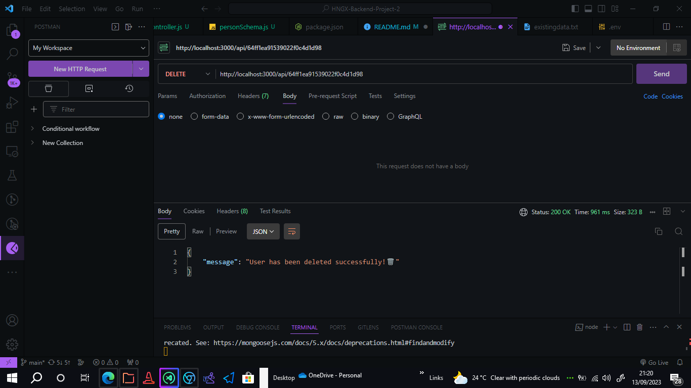

<p align="center">
  
</p>

<h1 align="center">Express CRUD API</h1>

<p align="center">
  
</p>

<p align="center">
  <b>A Node.js RESTful API Services with beautiful code written in JavaScript.</b></br>
  <span>Inspired by the awesome framework <a href="https://expressjs.com/">Express.js</a> in Node.js.</span></br>
  <sub>Made with ❤️ by <a href="https://github.com/WackyDawg">Julian Nwadinobi(wackydawg)</a></sub>
</p>

<br />


## ❯ Why

Our main goal with this project is a feature complete server application.
We like you to be focused on your business and not spending hours in project configuration.

Try it!! We are happy to hear your feedback or any kind of new features.

### Features

- **Beautiful Code** thanks to the awesome annotations of the libraries from [prettier](https://github.com/prettier).
- **Easy API Testing** with included e2e testing.
- **Clear Structure** with different layers such as controllers, services, repositories, models, middlewares...
- **Easy Exception Handling** thanks to [routing-controllers].
- **Smart Validation** thanks to [express-validator].
- **API Documentation** thanks to [swagger](http://swagger.io/) and [routing-controllers-openapi](https://github.com/epiphone/routing-controllers-openapi).
- **API Monitoring** thanks to [express-status-monitor](https://github.com/RafalWilinski/express-status-monitor).
- **Integrated Testing Tool** thanks to [Jest](https://facebook.github.io/jest).
- **E2E API Testing** thanks to [supertest](https://github.com/visionmedia/supertest) and [mocha] (https://github.com/mochajs/mocha), [chai] (https://github.com/chaijs/chai).
- **Basic Security Features** thanks to [Helmet](https://helmetjs.github.io/).


## ❯ Table of Contents

- [Getting Started](#-getting-started)
- [Scripts and Tasks](#-scripts-and-tasks)
- [API Routes](#-api-routes)
- [Project Structure](#-project-structure)
- [Further Documentations](#-further-documentations)
- [Related Projects](#-related-projects)
- [License](#-license)


## ❯ Getting Started

### Step 1: Set up the Development Environment

You need to set up your development environment before you can do anything.

Install [Node.js and NPM](https://nodejs.org/en/download/)

- on OSX use [homebrew](http://brew.sh) `brew install node`
- on Windows use [chocolatey](https://chocolatey.org/) `choco install nodejs`

Install yarn globally

```bash
yarn global add yarn
```


### Step 2: Create new Project

Fork or download this project. Configure your package.json for your new project.

Then copy the `.env.example` file and rename it to `.env`. In this file you have to add your database connection information.

Create a new database with the name you have in your `.env`-file.

Then setup your application environment.


Go to the project dir and start your app with this yarn script.

```bash
yarn start serve
```

> This starts a local server using `nodemon`, which will watch for any file changes and will restart the server according to these changes.
> The server address will be displayed to you as `http://0.0.0.0:3000`.


### Install

- Install all dependencies with `npm install`


### Tests

- Run the e2e tests using `npm test`.

### Running in dev mode

- Run `npm start` to start nodemon with ts-node, to serve the app.
- The server address will be displayed to you as `http://0.0.0.0:3000`


## ❯ API Routes

The route prefix is `/api` by default, but you can change this in the .env file.
The swagger and the monitor route can be altered in the `.env` file.

| Route          | Description |
| -------------- | ----------- |
| **/api**       | When a POST request is made to this endpoint with the body parameter it inserts the data to the cloud servers. |
| **/api/:userID**   | Allowed request GET,PUT,DELETE   |

## ❯ Postman
Use Postman for testing the API. You can use any client :). So open postman and create a new post request to http://localhost:3000/api with this in the body

```bash
{
  "name": "Clark Kent"
}
```

```bash
POST /api
```
## ❯ POST Request Response
```bash
{
    "message": "Person created successfully🎉",
    "newPerson": {
        "_id": "6502152763bcef1970ba0a28",
        "name": "Clark Kent",
        "__v": 0
    }
}
```


## To make GET request
create a new Get request to http://localhost:3000/api/6502152763bcef1970ba0a28
```bash
GET /api/:user_id
```

## ❯ GET Request Response
```bash
{
    "Person": {
        "_id": "6502152763bcef1970ba0a28",
        "name": "Clark Kent",
        "__v": 0
    }
}
```


## To make PUT request
create a new PUT request to http://localhost:3000/api/64ff1ea91539022f0c4d1d98
```bash
PUT /api/:user_id
```

## ❯ GET Request Response
```bash
{
    "message": "Successfully Updated",
    "updatedPerson": {
        "_id": "64ff1ea91539022f0c4d1d98",
        "name": "Julian Nwadinobi",
        "__v": 0
    }
}
```

## To make DELETE request
create a new DELETE request to http://localhost:3000/api/64ff1ea91539022f0c4d1d98
```bash
DELETE /api/:user_id
```

## ❯ DELETE Request Response
```bash
{
    "message": "User has been deleted successfully!🗑️"
}
```


## ❯ Project Structure

| Name                              | Description                                               |
| --------------------------------- | --------------------------------------------------------- |
| **.vscode/**                      | VSCode tasks, launch configuration, and other settings    |
| **controllers/**                  | CRUD operations for managing user resources               |
| **coverage**                      | Validation rules for request bodies and code coverage     |
| **models**                        | Data models and response interfaces for user resources    |
| **node_modules** *                | Custom type definitions and non-DefinitelyTyped files     |
| **router/**                       | API routing for user-related endpoints                    |
| **test/e2e/** *.test.js           | End-to-End tests for user creation and management         |
| .env.example                      | Example environment configuration settings                |
| .env.test                         | Test environment configuration settings                   |
| .gitignore                        | Ignore file for version control                           |
| index.js                          | Main application entry point                              |
| package-lock.json                 | Dependency lock file for package consistency              |
| package.json                      | Project dependencies and configurations                   |


## ❯ Further Documentations

| Name & Link                       | Description                       |
| --------------------------------- | --------------------------------- |
| [Express](https://expressjs.com/) | Express is a minimal and flexible Node.js web application framework that provides a robust set of features for web and mobile applications. |
| [Helmet](https://helmetjs.github.io/) | Helmet helps you secure your Express apps by setting various HTTP headers. It’s not a silver bullet, but it can help! |
| [Jest](http://facebook.github.io/jest/) | Delightful JavaScript Testing Library for unit and e2e tests |
| [supertest](https://github.com/visionmedia/supertest) | Super-agent driven library for testing node.js HTTP servers using a fluent API |
| [nock](https://github.com/node-nock/nock) | HTTP mocking and expectations library |
| [swagger Documentation](http://swagger.io/) | API Tool to describe and document your api. |


## ❯ License

[MIT](/LICENSE)